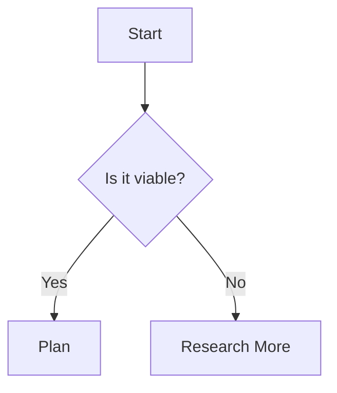
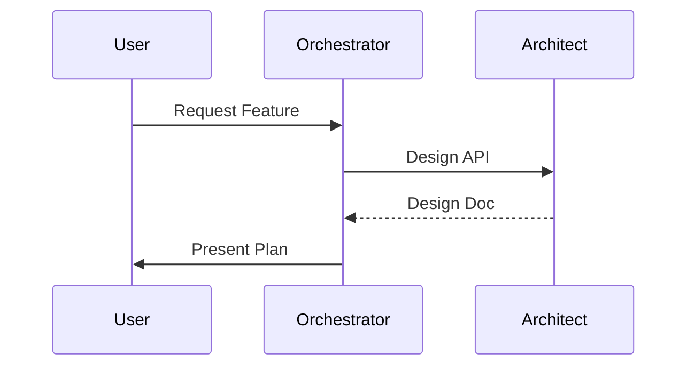
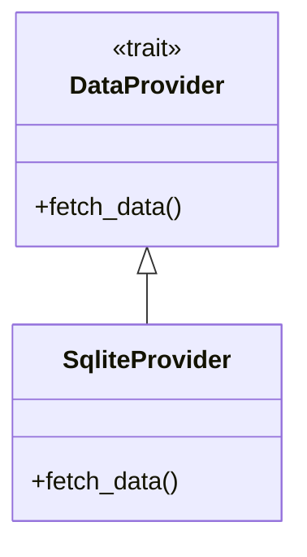

# Mermaid Diagramming Skill

Use Mermaid syntax to create visual representations of architecture, logic, and processes.

## Basic Syntax

### Flowchart


### Sequence Diagram


### Class Diagram (for Rust Structs/Traits)


## Guidelines for Agents
- Always wrap Mermaid code in ` ```mermaid ` blocks.
- Use `graph TD` (Top Down) or `graph LR` (Left to Right) for flowcharts.
- Use Mermaid for:
    - **Architect**: System module maps and trait hierarchies.
    - **Researcher**: Data flow and logic exploration.
    - **Documenter**: User guides and README visuals.
    - **Validator**: Test coverage maps or state transitions.
